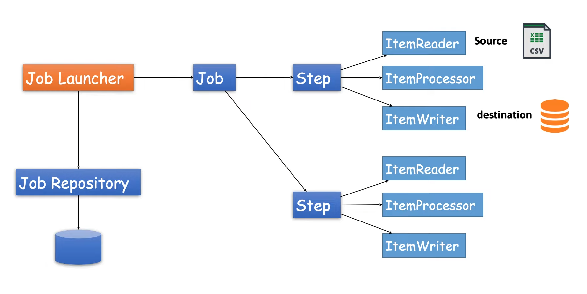

### Batch Processing

[spring.io - Spring Batch](https://spring.io/projects/spring-batch#overview)

A lightweight, comprehensive batch framework designed to enable the development of robust batch applications vital for 
the daily operations of enterprise systems.

Spring Batch provides reusable functions that are essential in processing large volumes of records, 
including logging/tracing, transaction management, job processing statistics, job restart, skip, 
and resource management. 
It also provides more advanced technical services and features that will enable extremely high-volume 
and high performance batch jobs through optimization and partitioning techniques. Simple as well as complex, 
high-volume batch jobs can leverage the framework in a highly scalable manner to process significant 
volumes of information.

Examples in different branches for normal flow batching and partition flow batching

